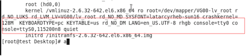

# 问题描述

当创建CentOS云主机时，若选择“镜像”作为启动源，则需要根据客户实际业务需求，提前制作云平台可用的CentOS镜像。

# 解决方案

不同版本CentOS镜像的制作过程略有差异，请根据客户实际业务需求，选择对应版本的操作步骤直接进行制作。

## 制作CentOS 7系列镜像

1. 安装系统并进行磁盘分区。

   登录KVM虚拟机后，请根据客户实际业务需求，安装操作系统和所需的应用软件，并设置磁盘分区。其中，磁盘根分区仅允许设置一个。

2. 配置SSH。

   1. 通过VIM编辑器，打开SSH配置文件（即/etc/ssh/sshd_config文件），并编辑以下内容:

           UseDNS no
           GSSAPIAuthentication no
           PasswordAuthentication yes

   2. 重启SSH服务。具体命令如下:

            systemctl restart sshd

3. 配置网卡。

   通过VIM编辑器，打开网卡配置文件（即/etc/sysconfig/network-scripts/ifcfg-eth0文件），并编辑以下内容:

       TYPE="Ethernet"
       BOOTPROTO="dhcp"
       DEVICE="eth0"
       ONBOOT="yes"

4. 配置Firewalld服务。

   停止Firewalld服务，并取消开机启动。具体命令如下:

       systemctl stop firewalld
       systemctl disable firewalld

5. 关闭SELinux。

   通过修改SELinux配置文件（即/etc/sysconfig/selinux），关闭SELinux。具体命令如下:

       sed -i "s/SELINUX=enforcing/SELINUX=disabled/g" /etc/sysconfig/selinux

6. 配置EPEL源。

   通过yum命令，配置EPEL源。具体命令如下:

       yum -y install http://dl.fedoraproject.org/pub/epel/7Server/x86_64/e/epel-release-7-8.noarch.rpm

7. 配置cloud-init。

   1. 通过yum命令，安装cloud-init。具体命令如下:

          yum -y install cloud-init cloud-utils parted

   2. 修改cloud.cfg配置文件。具体命令如下:

          sed -i 's/disable_root: 1/disable_root: 0/g' /etc/cloud/cloud.cfg
          sed -i 's/ssh_pwauth:.*/ssh_pwauth:\ \ 1/g' /etc/cloud/cloud.cfg
          sed -i 's/\ \ name: .*/\ \ name: es/g' /etc/cloud/cloud.cfg
          sed -i 's/lock_passwd: .*/lock_passwd: false/g' /etc/cloud/cloud.cfg
          sed -i 's/gecos: .*/gecos: es/g' /etc/cloud/cloud.cfg

8. 配置Console日志。

   本步骤将以Fedora为例进行说明，其image是F17-x86_64-cfntools。

   通过VIM编辑器，打开Console日志配置文件（即/etc/default/grub文件），并添加以下内容:

        GRUB_CMDLINE_LINUX_DEFAULT="console=ttyS0" grub2-mkconfig -o /boot/grub2/grub.cfg

9. 清除操作记录并封装镜像。

   1. 关闭虚拟机，并封装镜像。关闭虚拟机的具体命令如下:

          shutdown –h now

   2. 清除网络相关硬件生成信息。具体命令如下（其中， **centos-7.X** 为制作的镜像版本，请根据实际情况填写）:

          sudo virt-sysprep -d centos-7.X

## 制作CentOS 6系列镜像

1. 安装系统并进行磁盘分区。

   登录KVM虚拟机后，请根据客户实际业务需求，安装操作系统和所需的应用软件，并通过LVM方式设置磁盘分区。

2. 添加yum源。

   具体命令如下:

        cd /etc/yum.repos.d
        wget http://mirrors.163.com/.help/CentOS6-Base-163.repo
        sed -i 's/$releasever/6/g' CentOS6-Base-163.repo
        yum install -y http://dl.fedoraproject.org/pub/epel/6/x86_64/epel-release-6-8.noarch.rpm
        sed -i 's/#baseurl/baseurl/g' /etc/yum.repos.d/epel*
        sed -i 's/mirrorlist/#mirrorlist/g' /etc/yum.repos.d/epel*
        yum clean all

3. 关闭SELinux。

   通过修改SELinux配置文件（即/etc/sysconfig/selinux），关闭SELinux。具体命令如下:

        sed -i "s/SELINUX=enforcing/SELINUX=disabled/g" /etc/sysconfig/selinux

4. 关闭iptables。

   具体命令如下:

        /etc/init.d/iptables stop
        chkconfig iptables off
​
5. 配置网卡。

   通过VIM编辑器，打开网卡配置文件（即/etc/sysconfig/network-scripts/ifcfg-eth0文件），并编辑以下内容:

       TYPE="Ethernet"
       BOOTPROTO="dhcp"
       DEVICE="eth0"
       ONBOOT="yes"

6. 配置SSH。

   1. 通过VIM编辑器，打开SSH配置文件（即/etc/ssh/sshd_config文件），并编辑以下内容:

           UseDNS no
           GSSAPIAuthentication no
           PasswordAuthentication yes

   2. 重启SSH服务。具体命令如下:

            systemctl restart sshd

7. 配置Console日志。

   通过VIM编辑器，打开/boot/grub/menu.lst文件，并参考下图进行编辑。

   

8. 配置cloud-init。

   1. 通过yum命令，安装cloud-init。具体命令如下:

          yum -y install cloud-init cloud-utils parted

   2. 修改cloud.cfg配置文件。具体命令如下:

          sed -i '/- ssh$/ a - resolv-conf' /etc/cloud/cloud.cfg
          sed -i 's/disable_root: 1/disable_root: 0/g' /etc/cloud/cloud.cfg
          sed -i 's/ssh_pwauth:.*/ssh_pwauth:\ \ 1/g' /etc/cloud/cloud.cfg
          sed -i 's/\ \ name: .*/\ \ name: es/g' /etc/cloud/cloud.cfg
          sed -i 's/lock_passwd: .*/lock_passwd: false/g' /etc/cloud/cloud.cfg
          sed -i 's/gecos: .*/gecos: es/g' /etc/cloud/cloud.cfg

9. 配置rootfs。

   1. 配置_rootfs脚本。_具体命令如下（安装没有报错后，root分区可以自动扩展）:

          cd /tmp
          yum -y install git
          git clone https://github.com/flegmatik/linux-rootfs-resize.git
          cd linux-rootfs-resize
          ./install

   2. 设置rootfs支持RHEL系统。具体命令如下:

          sed -i 's/.*CentOS.*/ if | "$(cat \/etc\/redhat-release)" == Red\\ Hat*6*
          ./install

10. 清除操作记录并封装镜像。

   1. 清除网卡记录。具体命令如下:

          rm -f /etc/udev/rules.d/70-persistent-net.rules

   2. 关闭虚拟机，并封装镜像。关闭虚拟机的具体命令如下:

          shutdown –h now

   3. 清除网络相关硬件生成信息。具体命令如下（其中， **centos-6.X** 为制作的镜像版本，请根据实际情况填写）:

          sudo virt-sysprep -d centos-6.X

## 制作CentOS 5系列镜像

1. 安装系统并进行磁盘分区。

   登录KVM虚拟机后，请根据客户实际业务需求，安装操作系统和所需的应用软件，并通过LVM方式设置磁盘分区。

2. 关闭SELinux。

   通过修改SELinux配置文件（即/etc/sysconfig/selinux），关闭SELinux。具体命令如下:

        sed -i "s/SELINUX=enforcing/SELINUX=disabled/g" /etc/sysconfig/selinux

3. 关闭iptables。

   具体命令如下:

        /etc/init.d/iptables stop
        chkconfig iptables off

4. 配置网卡。

   通过VIM编辑器，打开网卡配置文件（即/etc/sysconfig/network-scripts/ifcfg-eth0文件），并编辑以下内容:

        TYPE="Ethernet"
        BOOTPROTO="dhcp"
        DEVICE="eth0"
        ONBOOT="yes"

5. 配置SSH。

   1. 通过VIM编辑器，打开SSH配置文件（即/etc/ssh/sshd_config文件），并编辑以下内容:

           UseDNS no
           GSSAPIAuthentication no
           PasswordAuthentication yes

   2. 重启SSH服务。具体命令如下:

            systemctl restart sshd

6. 添加yum源。

   具体命令如下:

            cd /etc/yum.repos.d
            wget http://mirrors.163.com/.help/CentOS6-Base-163.repo
            sed -i 's/$releasever/6/g' CentOS6-Base-163.repo
            yum install -y http://dl.fedoraproject.org/pub/epel/6/x86_64/epel-release-6-8.noarch.rpm
            sed -i 's/#baseurl/baseurl/g' /etc/yum.repos.d/epel*
            sed -i 's/mirrorlist/#mirrorlist/g' /etc/yum.repos.d/epel*
            yum clean all

7. 配置cloud-init。

   1. 通过yum命令，安装cloud-init。具体命令如下:

           yum -y install cloud-init

      > 说明：
      > 
      > Linux 5.X 系统上默认的Python版本是2.4，安装cloud-init后会自动升级到Python 2.6。

   2. 修改cloud.cfg配置文件。具体命令如下:

           sed -i '/- ssh$/ a - resolv-conf' /etc/cloud/cloud.cfg
           sed -i 's/disable_root: 1/disable_root: 0/g' /etc/cloud/cloud.cfg
           sed -i 's/ssh_pwauth:.*/ssh_pwauth:\ \ 1/g' /etc/cloud/cloud.cfg
           sed -i 's/\ \ name: .*/\ \ name: es/g' /etc/cloud/cloud.cfg
           sed -i 's/lock_passwd: .*/lock_passwd: false/g' /etc/cloud/cloud.cfg
           sed -i 's/gecos: .*/gecos: es/g' /etc/cloud/cloud.cfg

8. 配置rootfs。

   由于默认脚本不支持CentOS 5.X系列的扩容。所以，请执行以下操作，通过修改脚本增加Red Hat Enterprise Linux 5支持。

   1. 下载并解压linux-rootfs-resize-master安装包。下载地址如下(提取码请输入rakb):

        [http://pan.baidu.com/s/1eS6xTNO](http://pan.baidu.com/s/1eS6xTNO)

   2. 在安装包解压目录中，成功安装growpart-0.27-2.1.2.src.rpm后，通过VIM编辑器，打开growpart配置文件（即/usr/sbin/growpart），并注释453行的 **found=off** 和467～474行之间的内容。

   3. 在安装包解压目录中，拷贝distro/redhat-5目录下的growroot脚本文件至/usr/bin目录下。

   4. 为growroot脚本文件，添加可执行权限。具体命令如下:

           chmod o+x /usr/bin/growroot

   5. 在安装包解压目录中，安装_rootfs。_具体命令如下:

           ./install

      当成功执行（即无报错）后，会生成新的内核。当用该镜像创建云主机时，选择第一个内核启动会执行root扩容，请观察是否成功。

9. 清除操作记录并封装镜像。

   1. 关闭虚拟机，并封装镜像。关闭虚拟机的具体命令如下:

           shutdown –h now

   2. 清除网络相关硬件生成信息。具体命令如下（其中， **centos-5.X** 为制作的镜像版本，请根据实际情况填写）:

           sudo virt-sysprep -d centos-5.X
