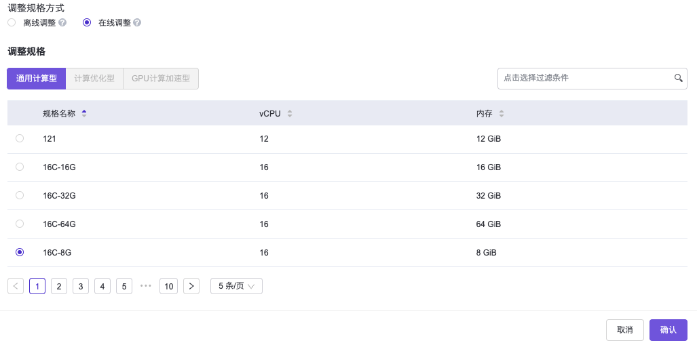

# 背景描述

当承载用户业务的云主机，已不能满足其上运行的应用对算力日益增长的需求时，通常需要通过横向扩容或纵向扩容的方式进行云上扩容。两种扩容方式的具体说明如下：

* 横向扩容：即通过创建更多的云主机，分担业务处理压力。例如：当一个Web应用服务器的CPU消耗和内存消耗都已达到85%以上，且客户侧的访问压力还在不断增长时，管理员可以通过在负载均衡下创建更多的Web应用服务器副本，支持不断增长的业务访问压力，使整个系统的处理能力得到横向扩展。

* 纵向扩容：即通过扩容原云主机的vCPU和内存，提高云主机自身算力。针对不支持横向扩容的应用系统，例如NFV负载（如虚拟路由器或网关等），只能通过对原云主机纵向扩容实现云上扩容。

针对云主机的纵向扩容，在V6.1.1之前版本的计算云产品中，只支持通过关机后再调整规格的方式实现，但是在V6.1.1及其之后版本的计算云产品中，支持利用云主机操作系统的热添加能力，在不停机的情况下调整云主机规格，实现在不影响业务连续性的前提下对云主机实施在线纵向扩容。本文将详细介绍如何利用云主机的在线调整规格功能，实现云主机的在线纵向扩容。

> 说明：
> 
> * 由于在线扩容场景有使用边界的限制，例如需要云主机操作系统支持热添加能力等，强烈建议用户在创建云主机时提前做好容量规划。如若后期确需扩容，请谨慎使用在线扩容云主机功能。
> * 在线扩容场景的具体使用限制，请参考[在线调整云主机规格使用限制](../Introduction/Limitations.html#针对在线调整云主机规格)。

# 前提条件

* 该云主机在创建时所用的镜像已开启在线变更规格属性。具体开启在线变更规格的操作，请参考“镜像”帮助中“修改配置”的相关内容。
* 该云主机操作系统支持热添加能力。

# 操作步骤

1. 在云平台的顶部导航栏中，依次选择\[产品与服务]-\[计算]-\[云主机]，进入“云主机”页面。

2. 勾选待操作云主机后，单击 `更多`-`调整规格`，弹出“调整云主机规格”对话框。

3. “调整规格方式”选择“在线调整”，并选择调整规格后，单击 `确定` ，完成操作。

   

   > 说明：
   > 
   > * 由于只支持在线调大云主机的CPU和内存规格，所以在上述对话框的规格列表中，仅展示比原规格大的规格（即：vCPU或内存至少有一个大于原规格中的对应值）。
   > * 目前仅支持针对通用计算型的云主机在线调整规格，其规格调整范围也仅限于通用计算型范围内。

# 结果验证

1. 在云平台页面确认云主机规格已调整。

   1. 在云平台的顶部导航栏中，依次选择\[产品与服务]-\[计算]-\[云主机]，进入“云主机”页面。

   2. 单击上述云主机名称，进入其详情页面。在该页面的“详细配置”区域框中，确认“规格名称”参数的值已变更为上述新调整规格的名称。

2. 在云主机操作系统确认云主机规格已调整。

   1. 在云平台的顶部导航栏中，依次选择\[产品与服务]-\[计算]-\[云主机]，进入“云主机”页面。

   2. 单击上述云主机的VNC图标，进入VNC Console页面，执行相应命令或操作查看操作系统当前CPU和内存的值，确认已成功调整。