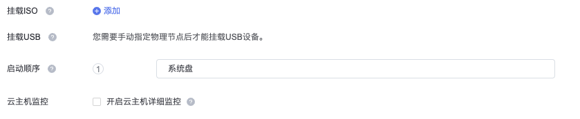
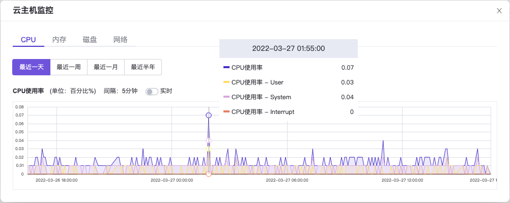
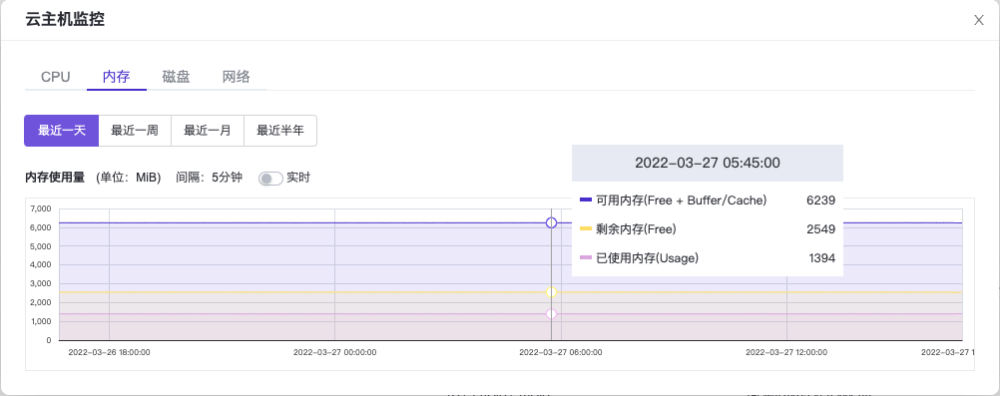
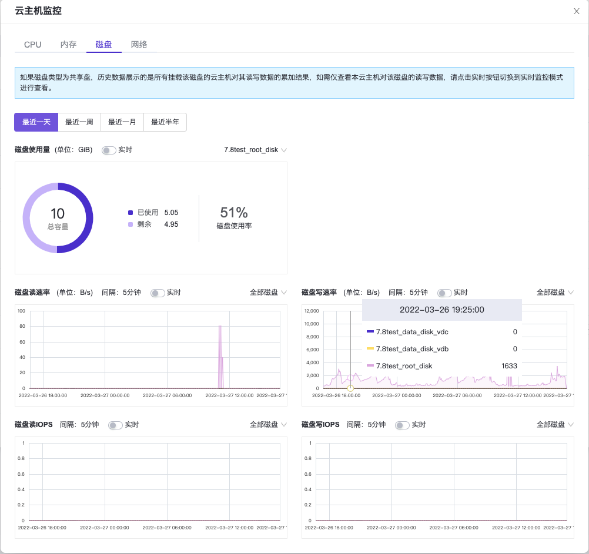
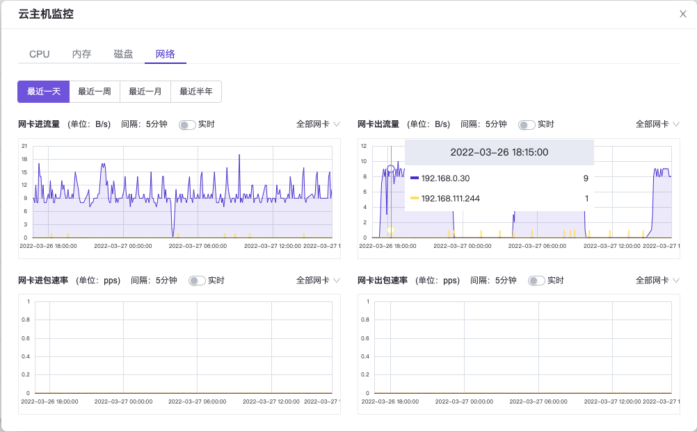

# 背景描述

云主机作为客户应用的运行载体是平台多元算力的提供者之一，其各项指标是否工作正常与客户应用能否持续稳定运行息息相关，所以云主机的可观测性向来是客户比较观注的云平台基础能力之一。

在计算云产品的V6.1.1之前版本中，仅为云主机提供基础监控能力（基础监控模式），即通过调用虚拟化管理程序的API接口，从外部获取云主机的基础监控数据。该监控模式的优点是可以以非侵入的方式，简单方便地获取到云主机的基础监控数据，但不足之处是一些特定的监控数据获取不到或是特定场景下获取的某些监控指标不是特别精准，例如云主机的系统盘使用量无法获取，Windows操作系统场景下获取的内存使用数据不够精准等。

为了解决上述问题，在计算云产品的V6.1.1版本中，为云主机引入内置Agent的监控模式（详细监控模式），该模式需要云主机内预先安装qemu-guest-agent（以下简称qga），qga的工作原理及安装步骤请参考[如何安装QEMU Guest Agent](../FAQs/DeployQGA.html)。在详细监控模式下，云主机的各项监控数据均由运行在云主机操作系统里的后台守护进程qga获取并返回给云平台控制面，所以在该模式下能获取到任意维度的云主机监控数据，同时获取到的数据会更加精准。

本文将详细介绍如何使用云主机的详细监控模式。

> 说明：
>
> 云主机的两种监控模式互有利弊，请根据客户实际业务需求酌情选择适合自己的监控模式。

# 前提条件

* 已完成 [制作并上传镜像](../GettingStarted/PrerequisitePreparation.html#制作并上传镜像) 、 [创建安全组（可选）](../GettingStarted/PrerequisitePreparation.html#创建安全组（可选）) 和 [云主机规格](../GettingStarted/CreateInstanceFlavor.html) 操作。其中，在执行“制作并上传镜像”操作时，请确保已配置“启用云主机内置Agent”为“是”。
* 已完成 [前置条件准备](../GettingStarted/PrerequisitePreparation.html) 操作。
* （可选）已根据需要完成 [创建可用区](../GettingStarted/CreateAZ.html) 、 [创建SSH密钥对](../GettingStarted/CreateSSHKeyPair.html) 和 [创建云主机组](../GettingStarted/CreateInstanceGroup.html) 操作。

# 操作步骤

1. 在云平台的顶部导航栏中，依次选择\[产品与服务]-\[计算]-\[云主机]，进入“云主机”页面。

2. 单击 `创建云主机` ，进入“创建云主机”的“基础配置”页面。

3. 配置参数后，单击 `下一步：网络配置` ，进入“网络配置”页面。其中，该页面中各参数的具体说明，请参考 [创建云主机](../GettingStarted/CreateInstance.html) 。

4. 在“高级选项”中勾选“开启云主机详细监控”，并配置其他参数后，单击 `下一步：系统配置` ，进入“系统配置”页面。其中，该页面中各参数的具体说明，请参考 [创建云主机](../GettingStarted/CreateInstance.html) 。

   

   > 说明：
   >
   > 当所选云主机启动镜像的“启用云主机内置Agent”属性未开启时，此处的“开启云主机详细监控”复选框将被置灰不可选。

5. 配置参数后，单击 `下一步：确认配置` ，进入“确认配置”页面。其中，该页面中各参数的具体说明，请参考 [创建云主机](../GettingStarted/CreateInstance.html) 。

6. 在“确认配置”页面中，确认云主机的配置信息后，单击 `创建云主机` ，完成操作。

7. (可选)如果云主机启动镜像中没有预先安装qga，可以在云主机启动后再安装，安装方法同样参考[如何安装QEMU Guest Agent](../FAQs/DeployQGA.html)。

# 结果验证

1. 在云平台的顶部导航栏中，依次选择\[产品与服务]-\[计算]-\[云主机]，进入“云主机”页面。

2. 单击上述云主机的监控图标，查看云主机当前的监控数据。具体支持获取和展示的监控指标请参考[详细监控功能指标展示详情](../Introduction/Limitations.html#针对开启详细监控)。

   页面的可视化展现效果如下。在该页面中，单击 `实时` 开关，可以在历史数据和实时数据视图之间切换展示。

   * CPU监控：
   

   * 内存监控：
   

   * 磁盘监控：
   

   * 网络监控：
   