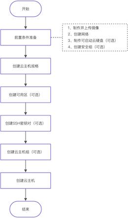

计算服务使用流程及具体说明如下：

<table>
<thead>
    <tr>
        <th colspan="2">操作流程</th>
        <th>描述</th>
    </tr>
</thead>
<tbody>
    <tr>
        <td rowspan="4">前置条件准备</td>
        <td>制作并上传镜像</td>
        <td>为云主机制作创建所需的镜像文件，并上传镜像。</td>
    </tr>
    <tr>
        <td>创建网络</td>
        <td>根据网络规划，为云主机预创建所需的网络。</td>
    </tr>
    <tr>
        <td>制作可启动云硬盘（可选）</td>
        <td>当云主机需要使用可启动云硬盘作为启动源时，请先为云主机制作创建所需的可启动云硬盘。 请根据客户实际业务需求酌情创建。仅当云主机启动源选择可启动云硬盘时，才需执行本步骤。</td>
    </tr>
    <tr>
        <td>创建安全组（可选）</td>
        <td>为云主机预创建安全组，用于控制网络访问。 请根据客户实际业务需求酌情创建。如已有可用安全组或使用默认default时，可跳过本步骤。</td>
    </tr>
    <tr>
        <td colspan="2">创建云主机规格</td>
        <td>为云主机创建不同计算、内存和存储能力的规格模板。</td>
    </tr>
    <tr>
        <td colspan="2">创建可用区（可选）</td>
        <td>配置计算节点的主机集合和可用区，以便区分资源的物理位置和放置不同规格的云主机。 请根据客户实际业务需求酌情创建。如已有可用可用区或使用默认default-az时，可跳过本步骤。</td>
    </tr>
    <tr>
        <td colspan="2">创建SSH密钥对（可选）</td>
        <td>为云主机创建SSH密钥对，以便作为远程登录云主机的凭证。 请根据客户实际业务需求酌情创建。如已有可用SSH密钥对或仅设置密码登录时，可跳过本步骤。</td>
    </tr>
    <tr>
        <td colspan="2">创建云主机组</td>
        <td>为云主机创建云主机组，以便通过逻辑分组方式控制云主机在计算节点中的分布。 请根据客户实际业务需求酌情创建。如业务应用没有亲和或非亲和性需求时，可跳过本步骤。</td>
    </tr>
    <tr>
        <td colspan="2">创建云主机</td>
        <td>依据客户实际业务需求，创建包含CPU、内存、操作系统、网络配置、云硬盘等基础资源的云主机，为客户提供可靠、安全、灵活、高效的计算环境。</td>
    </tr>
</tbody></table>

