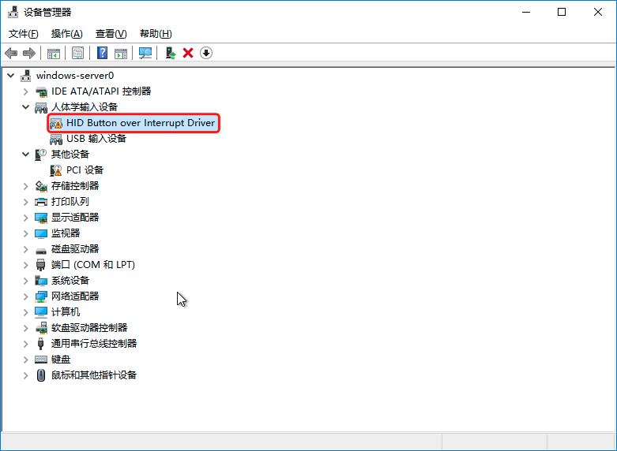
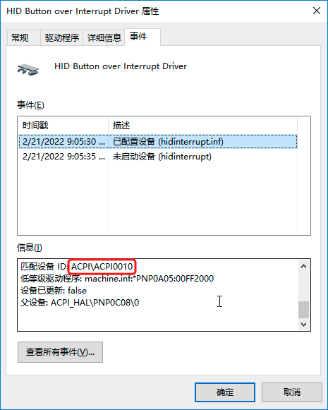
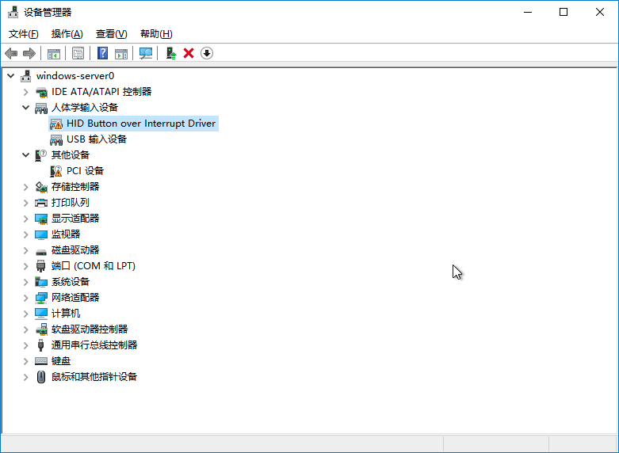
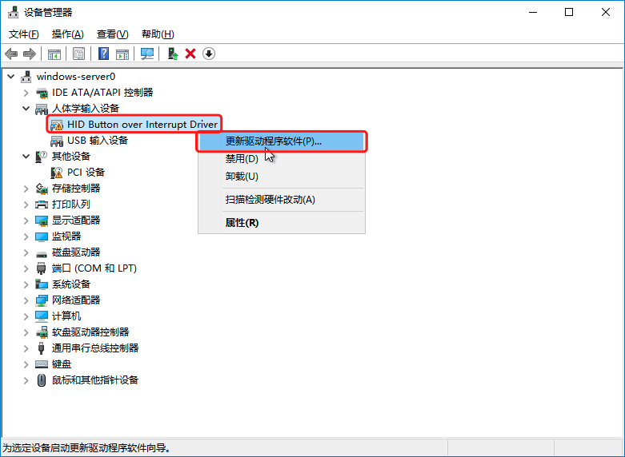
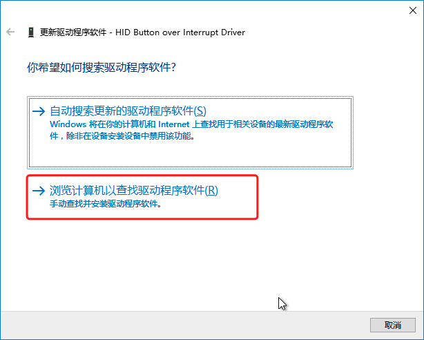
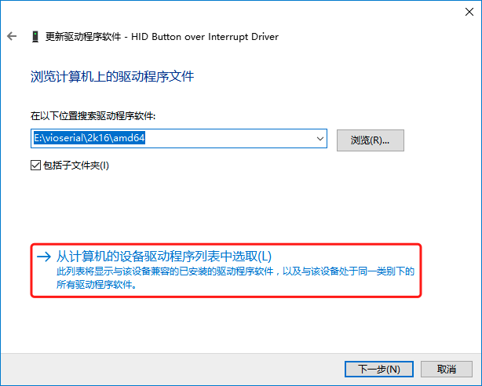
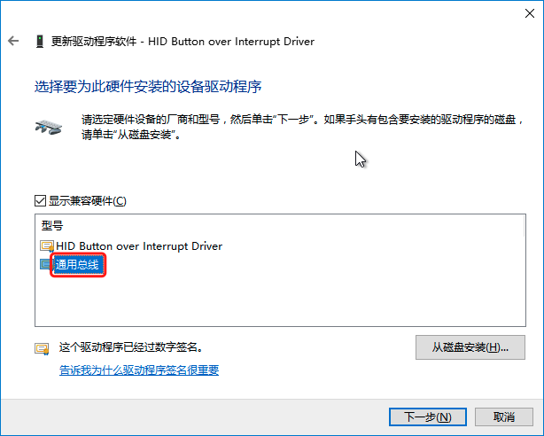
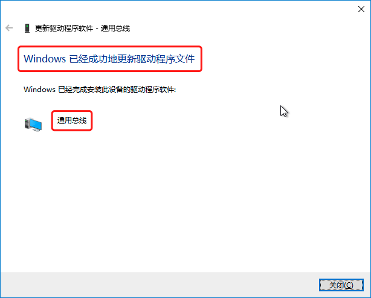

# 问题描述

对Windows Server 2016的云主机在线调整规格后，在云主机内部查看CPU个数没有变化。

# 问题确认

1. 在虚拟机内打开设备管理器(Device Manager)，发现”HID Button over Interrupt Driver”驱动显示一个警告符。

   

2. 点击“HID Button over Interrupt Driver”，查看警告对应的设备ID是ACPI\ACPI0010。

   

# 问题原因

ACPI0010 在ACPI规范中对应的是CPU热插设备。由于微软的ACPI driver的缺陷，“HID Button over Interrupt Driver”驱动占用了这个CPU热插设备，导致了热插CPU失败。

# 解决方案

在虚拟机内，使Windows驱动选择正确的设备。

1. 在虚拟机内打开设备管理器(Device Manager)。

   

2. 右击[ HID Button over Interrupt Driver ], 选择[ 更新驱动程序软件 ]。

   

3. 选择[ 浏览计算机以查找驱动程序软件 ]。

   

4. 选择[ 从计算机的设备驱动程序列表中选取 ]。

   

5. 选择[ 通用总线 ] 并点击[ 下一步 ]。

   

6. 待更新完毕，关闭窗口。

   

7. 再次对该云主机做在线调整规格操作，问题解决。
