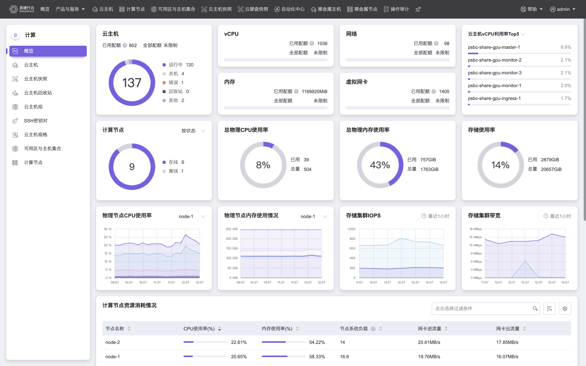
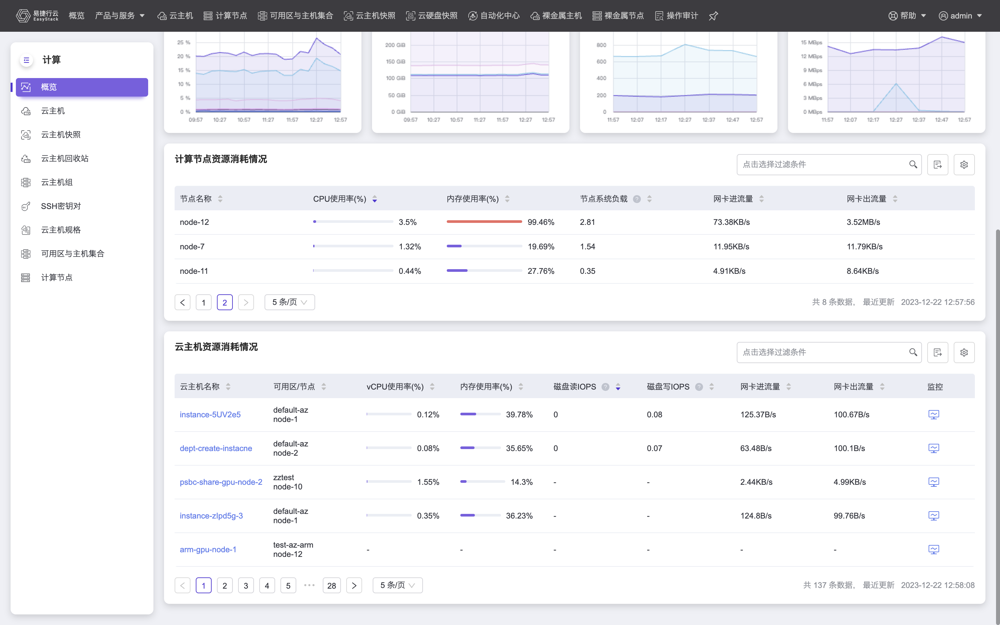
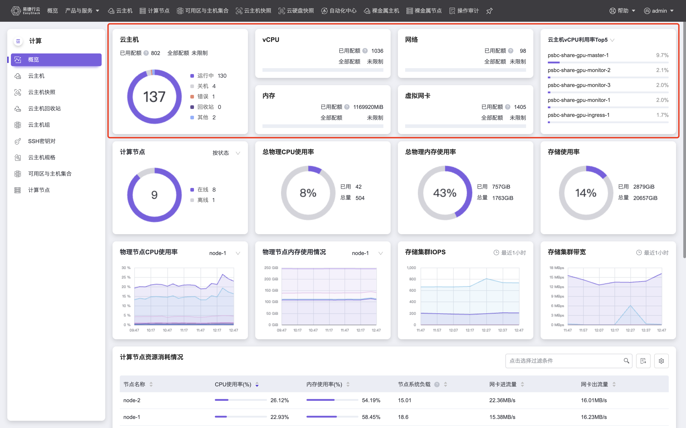
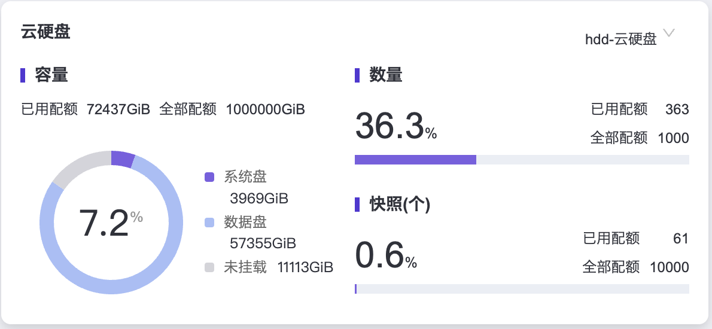
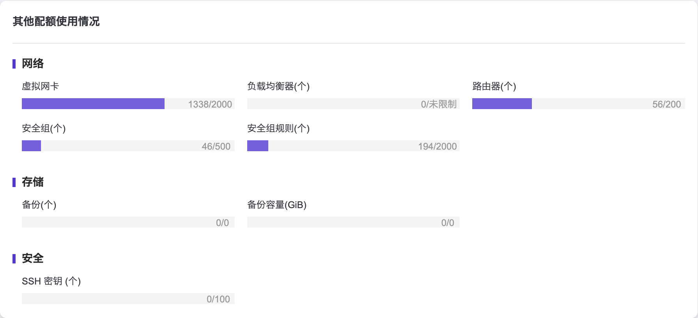
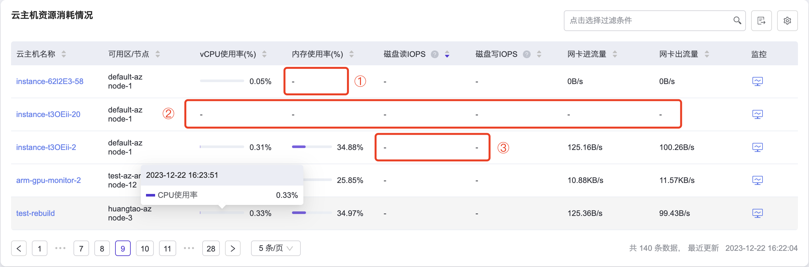
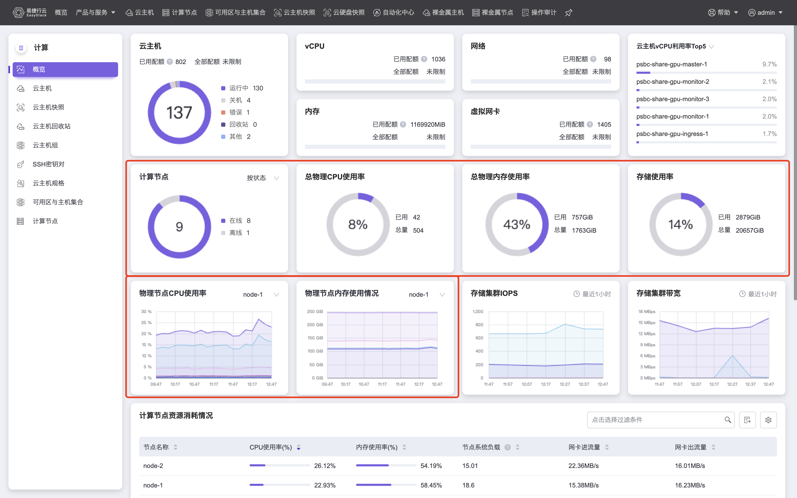
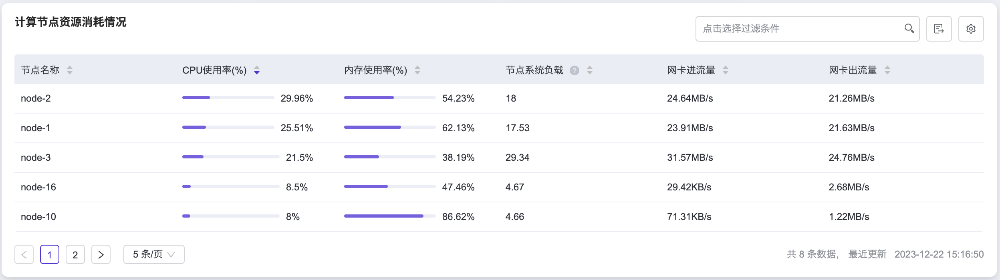
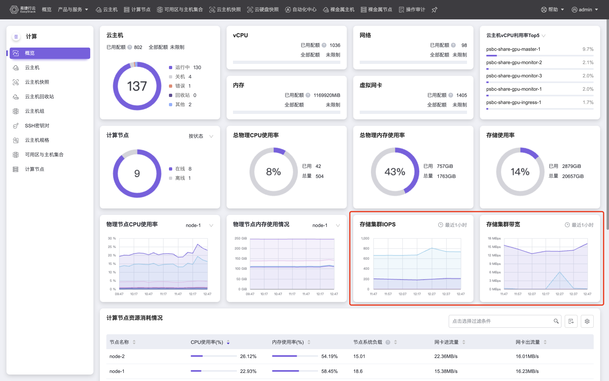

本章节主要介绍在计算云产品的概览页面中，整体监控信息的概括说明，帮助用户迅速定位集群异常状态，页面包含诸多模块，我们将其分类为虚拟资源状态、物理集群状态和存储集群状态，本章节将分类说明。在计算云产品的左侧导航栏中选择[概览]，即可访问“概览”页面，下面两张图是在云管理员视角下“概览”页面的全貌，对于非云管理员角色的用户，概览页面展示的模块有所差别，这一点也会在本章节的描述中有所体现。

# 虚拟资源状态

**虚拟资源状态** 对应图中标红区域，是对平台中虚拟资源的概况展示。展示集群中创建的云主机总数，不同状态的云主机数目，以及项目中vCPU、内存、网络、虚拟网卡等虚拟资源的配额使用情况。

对于非云管理员角色的用户，概览页面在虚拟资源状态中增加如下面两张图所示的“云硬盘”和“其他网络配额使用情况”模块，“云硬盘”模块可按照云硬盘类型查看项目中使用的云硬盘资源，包括容量利用率、云硬盘总数、云硬盘快照总数等，“其他网络配额使用情况”模块可展示网络、存储以及安全相关的配额使用情况，方便您根据页面中展示出的数据合理利用资源。

如果您关注项目中虚拟资源使用总量，那么应该关注“已用配额”反映出的项目中所有云主机使用资源量总和，如果您更关注于每台云主机资源利用率情况，我们提供了两个模块供您参考：

- **云主机vCPU/内存利用率Top5**：请注意，即使您是云管理员用户，该模块也只能展示本项目下的利用率Top5信息。以admin用户作为云管理员为例，这意味着：如果admin项目下没有创建云主机，但是其他项目下存在若干云主机，那么admin用户作为云管理员也无法获取平台全局的Top5信息。
- **云主机资源消耗情况**：如果您是云管理员用户，该模块将展示平台中所有云主机**最近五分钟**的资源使用情况并支持数据导出，如下图所示，包括vCPU使用率、内存使用率、磁盘读写IOPS、网卡进出流量等，详细监控较基础监控支持更多的监控指标，可将鼠标hover在进度条上显示更多的指标数据，每一项指标均支持正向、逆向排序，同时“监控”栏也可以查询单台云主机监控数据。非云管理员用户只能获取所属项目下的云主机资源使用情况，该模块每五分钟自动刷新。

> [!WARNING]
> 1.当您的云主机的操作系统镜像没有安装 virtio_ballon 驱动时（一般 Windows 操作系统默认不安装该驱动，需要另行安装。），将无法获取到云主机的内存使用率，内存使用率指标会显示为如图中①所对应的“-”。
2.若云主机处于错误状态或云主机内部操作系统运行异常等情况，则该云主机的所有指标将显示为图中②所对应的“-”。
3.只有详细监控模式才支持对磁盘读写IOPS指标进行监控，若云主机为基础监控模式，则磁盘读写IOPS指标将显示为图中③所对应的“-”，您可以根据[查看详情](./Instance.html#查看详情)中“切换监控模式”的相关描述，将云主机切换为详细监控模式，页面提示切换成功后等待片刻即可正常显示磁盘读写IOPS指标。

# 物理资源状态

**物理资源状态** 对应图中标红区域，是对平台中物理资源的概况展示，只对云管理员开放，如果您是非云管理员角色，将无法获取物理资源状态信息。物理资源状态展示项中您可以清晰查看节点在线/离线等状态、物理CPU/内存/存储使用情况等。物理资源状态也可以帮助您一目了然的了解到集群的物理资源使用情况，当资源不足时，需要尽快扩容或清理资源。

您可以从中获取平台全局的物理资源使用情况，如果您更关注单台计算节点的物理资源使用情况，我们提供了两个模块供您参考：
- **单台计算节点资源使用情况折线图**：如上图下方红框内所示，您可以选择某个计算节点以具体关注其CPU、内存消耗以及变动情况。
- **平台所有计算节点资源使用情况列表**：如下图所示，该模块为云管理员展示了平台中所有计算节点资源使用情况并支持数据导出，包括CPU使用率、内存使用率、节点系统负载、网卡进出流量等，可将鼠标hover在进度条上显示更多的指标数据，每一项指标均支持正向、逆向排序。该模块每五分钟自动刷新。

# 存储集群状态

**存储集群状态** 对应图中标红区域，两幅折线图分别展示出存储集群读写IOPS以及读写带宽，只对云管理员开放，如果您是非云管理员角色，将无法获取存储集群状态信息。

